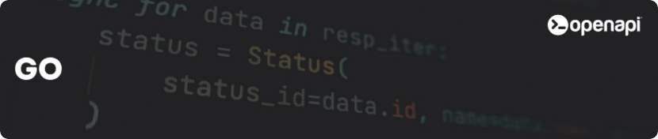

<div align="center">
  <a href="https://openapi.com/">
    
  </a>

  <h1>Openapi® client for Go</h1>
  <h4>The perfect starting point to integrate <a href="https://openapi.com/">Openapi®</a> within your Go project</h4>

[](https://github.com/openapi/openapi-go-sdk/actions/workflows/go.yml)
[](https://goreportcard.com/report/github.com/openapi/openapi-go-sdk)
[](https://pkg.go.dev/github.com/openapi/openapi-go-sdk)
[](LICENSE)
<br>
[](https://www.linuxfoundation.org/about/members)
</div>

## Overview

A minimal and agnostic Go SDK for Openapi, providing only the core HTTP primitives needed to interact with any Openapi service.

## Pre-requisites

Before using the Openapi Go Client, you will need an account at [Openapi](https://console.openapi.com/) and an API key to the sandbox and/or production environment.

## Features

- **Agnostic Design**: No API-specific classes, works with any Openapi service
- **Minimal Dependencies**: Only requires Go 1.19+
- **OAuth Support**: Built-in OAuth client for token management
- **HTTP Primitives**: GET, POST, PUT, DELETE and other HTTP methods
- **Clean Interface**: Simple and idiomatic Go API

## What you can do

With the Openapi Go Client, you can easily interact with a variety of services in the Openapi Marketplace. For example, you can:

- 📩 **Send SMS messages** with delivery reports and custom sender IDs
- 💸 **Process bills and payments** in real time via API
- 🧾 **Send electronic invoices** securely to the Italian Revenue Agency
- 📄 **Generate PDFs** from HTML content, including JavaScript rendering
- ✉️ **Manage certified emails** and legal communications via Italian Legalmail

For a complete list of all available services, check out the [Openapi Marketplace](https://console.openapi.com/) 🌐

## Installation

Add the SDK to your project:

```bash
go get github.com/openapi/openapi-go-sdk
```

Then import the client package:

```go
import "github.com/openapi/openapi-go-sdk/pkg/client"
```

## Usage

### Token generation

Use `OauthClient` to authenticate with your credentials and generate a scoped access token.
The `test` flag switches between the sandbox (`true`) and production (`false`) OAuth endpoint.

```go
package main

import (
	"context"
	"encoding/json"
	"fmt"
	"log"

	"github.com/openapi/openapi-go-sdk/pkg/client"
)

func main() {
	ctx := context.Background()

	oauthClient := client.NewOauthClient("<your_username>", "<your_apikey>", true)

	scopes := []string{
		"GET:test.imprese.openapi.it/advance",
		"POST:test.postontarget.com/fields/country",
	}
	resp, err := oauthClient.CreateToken(ctx, scopes, 3600)
	if err != nil {
		log.Fatal(err)
	}

	tokenResponse := struct {
		Scopes []string `json:"scopes"`
		Token  string   `json:"token"`
	}{}
	if err := json.Unmarshal([]byte(resp), &tokenResponse); err != nil {
		log.Fatal(err)
	}

	fmt.Printf("token: %s\n", tokenResponse.Token)
}
```

### Making API calls

Use `Client` with the token obtained above to call any Openapi service.
Pass the base URL and endpoint separately so the client can correctly attach query parameters.

```go
package main

import (
	"bytes"
	"context"
	"encoding/json"
	"fmt"
	"log"

	"github.com/openapi/openapi-go-sdk/pkg/client"
)

func main() {
	ctx := context.Background()
	apiClient := client.NewClient("<your_access_token>")

	// GET with query parameters
	params := map[string]string{
		"denominazione": "altravia",
		"provincia":     "RM",
		"codice_ateco":  "6201",
	}
	result, err := apiClient.Request(ctx, "GET", "https://test.imprese.openapi.it", "/advance", nil, params)
	if err != nil {
		log.Fatal(err)
	}
	fmt.Println(result)

	// POST with a JSON payload
	payload := struct {
		Limit int `json:"limit"`
		Query struct {
			CountryCode string `json:"country_code"`
		} `json:"query"`
	}{
		Limit: 10,
		Query: struct {
			CountryCode string `json:"country_code"`
		}{CountryCode: "IT"},
	}
	var buf bytes.Buffer
	if err := json.NewEncoder(&buf).Encode(payload); err != nil {
		log.Fatal(err)
	}
	result, err = apiClient.Request(ctx, "POST", "https://test.postontarget.com", "/fields/country", &buf, nil)
	if err != nil {
		log.Fatal(err)
	}
	fmt.Println(result)
}
```

More complete examples are available in the [`examples/`](examples/) directory.

## Testing

The SDK ships with a suite of unit tests that use `net/http/httptest` — no real network calls, no credentials needed.

Run the full suite:

```bash
go test ./...
```

Run with verbose output to see each test case:

```bash
go test -v ./pkg/client/...
```

Run a single test by name:

```bash
go test -v -run TestCreateToken ./pkg/client/...
```

## Contributing

Contributions are always welcome! Whether you want to report bugs, suggest new features, improve documentation, or contribute code, your help is appreciated.

See [docs/contributing.md](docs/contributing.md) for detailed instructions on how to get started. Please make sure to follow this project's [docs/code-of-conduct.md](docs/code-of-conduct.md) to help maintain a welcoming and collaborative environment.

## Authors

Meet the project authors:

- Michael Cuffaro ([@maiku1008](https://www.github.com/maiku1008))
- Openapi Team ([@openapi-it](https://github.com/openapi-it))

## Partners

Meet our partners using Openapi or contributing to this SDK:

- [Blank](https://www.blank.app/)
- [Credit Safe](https://www.creditsafe.com/)
- [Deliveroo](https://deliveroo.it/)
- [Gruppo MOL](https://molgroupitaly.it/it/)
- [Jakala](https://www.jakala.com/)
- [Octotelematics](https://www.octotelematics.com/)
- [OTOQI](https://otoqi.com/)
- [PWC](https://www.pwc.com/)
- [QOMODO S.R.L.](https://www.qomodo.me/)
- [SOUNDREEF S.P.A.](https://www.soundreef.com/)

## Our Commitments

We believe in open source and we act on that belief. We became Silver Members
of the Linux Foundation because we wanted to formally support the ecosystem
we build on every day. Open standards, open collaboration, and open governance
are part of how we work and how we think about software.

## License

This project is licensed under the [MIT License](LICENSE).

The MIT License is a permissive open-source license that allows you to freely use, copy, modify, merge, publish, distribute, sublicense, and/or sell copies of the software, provided that the original copyright notice and this permission notice are included in all copies or substantial portions of the software.

In short, you are free to use this SDK in your personal, academic, or commercial projects, with minimal restrictions. The project is provided "as-is", without any warranty of any kind, either expressed or implied, including but not limited to the warranties of merchantability, fitness for a particular purpose, and non-infringement.

For more details, see the full license text at the [MIT License page](https://choosealicense.com/licenses/mit/).